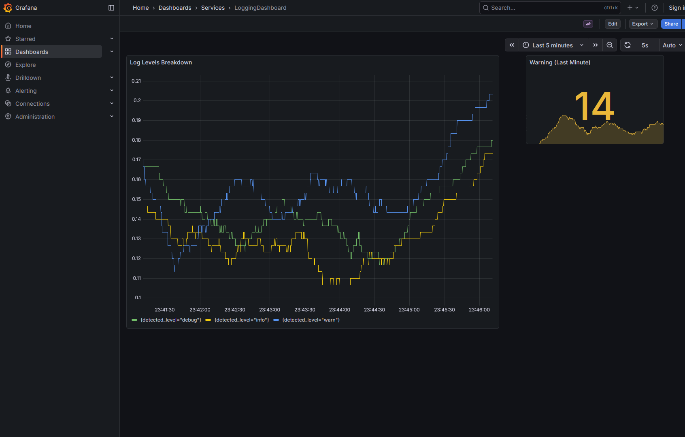
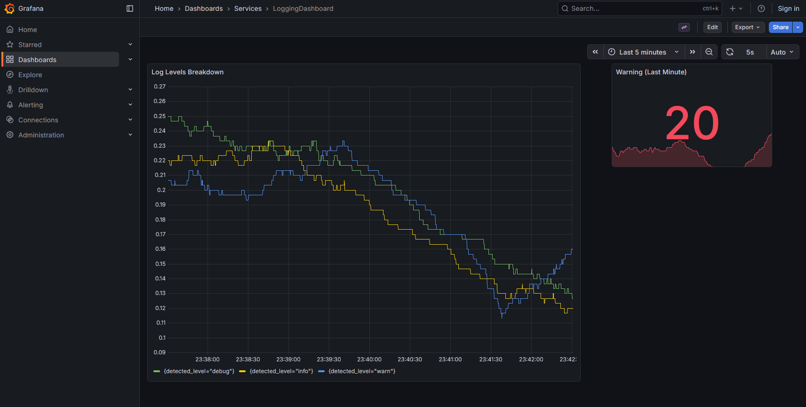

# ie7343-mlops-lab2

This adapation is an extension of the starter logging code. 

Rather than log to a file (as done in the lab), we integrate Graphana
to have more advanced insignts into the logs and createa a dashboard
reporting app status!

This is a big change from the lab code which just used basic python logging!

The screenshots of the dashboard are shown below:

## Low Error Count

## High Error Count

# Steps to run yourself

1. clone this repo into a folder called `lab2`
  - `git clone git@github.com:ALearningCurve/ie7343-mlops-lab2.git lab2`
2. change directory into the repo `cd lab2`
3. start all services with `docker compose up --build` (make sure all containers start)
4. (optional) you can check that the ingress pipeline is working as follows
  - Loki handles log interactions, expect to see "ready" when visiting the status url for [ingres](http://localhost:3102/ready) and [query](http://localhost:3101/ready)
  - Alloy handles streaming logs from python app to loki, expect to see HEALTHY statuses when visiting [alloy](http://localhost:12345)
5. visit the [local graphana instance](http://localhost:3000)
6. click "Dashboards" button on the sidebar and then when the page redirects click "Services" and then "Logging Dashboard". You should now see the same view as where the screenshots were taken.

# References

- https://grafana.com/docs/loki/latest/get-started/quick-start/quick-start/
  - The docker-compose and system layout is largely sourced from this post

- https://stackoverflow.com/questions/63518460/grafana-import-dashboard-as-part-of-docker-compose
  - For defining the dashboard as code